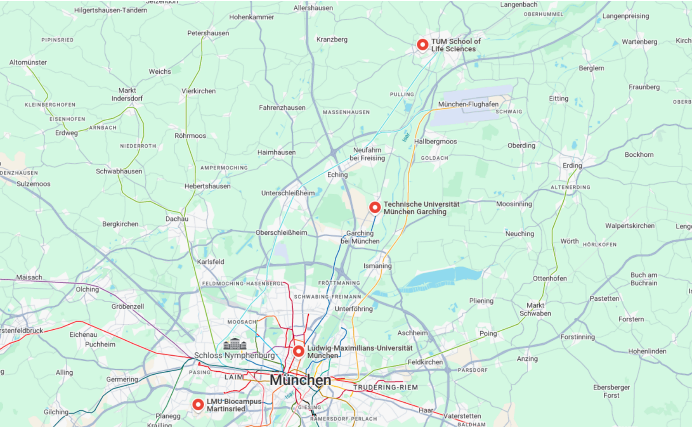
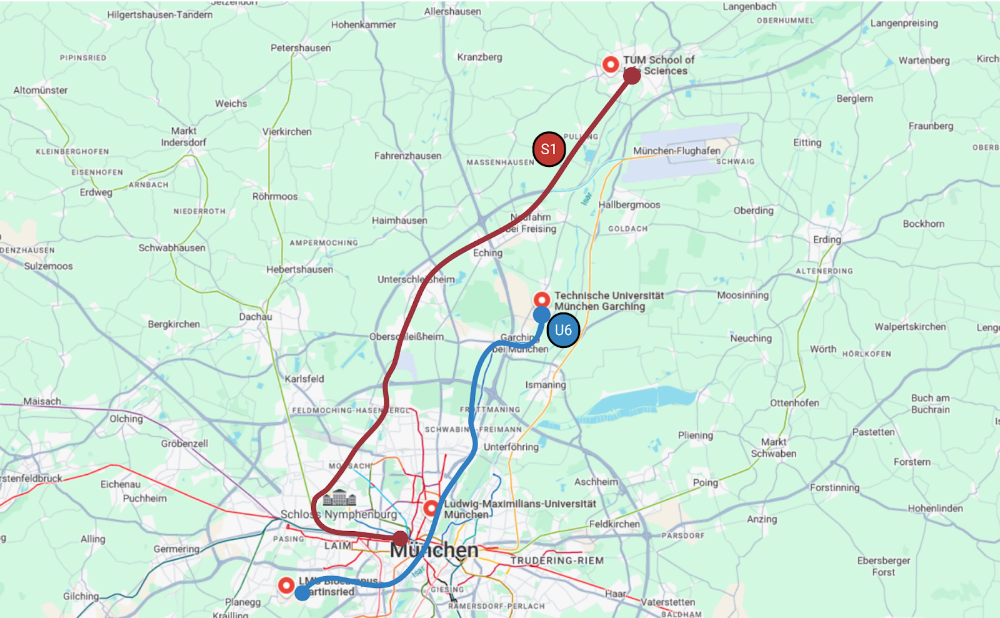

# The Optimal Place to Live

We know that the housing market in Munich is unfortunately very unforgiving, and normally 
you can't really choose your desired location. However, if you find yourself in a situation 
where you need to decide between two or more apartments, we want to help you a bit with the 
decision process. In our degree program, there are many locations in and around Munich.
You will already have to travel back and forth a lot in your everyday student life. 
If you are additionally poorly connected to the usual bioinformatics subway lines, 
you will spend a lot of extra time on public transport.

Additionally, your choice of the Math/CS track (i.e., TUM/LMU tracks) in the 1st semester has a major influence on where your main locations will be. More about this [here](/en/prospectives/program-contents#computer-sciencemathematicsstatistics).

## Locations and Connections

Here are the four main locations:

And here are the public transport options that are directly (or almost directly) connected to the main locations:

The following locations are relevant regardless of your choice of Math/CS track:

- [LMU Math Building](https://maps.app.goo.gl/yd4G3fdMNzpW1teA7)
- [LMU Geology Building](https://maps.app.goo.gl/ffreMrfYtsvuY7d6A)
- [LMU Großhadern BioChem Campus](https://maps.app.goo.gl/KXte2qbiHLawphnt5)

The following location is only relevant for the LMU track:

- [LMU Main Building](https://maps.app.goo.gl/nUSBNo8rH7AJVQvq9)

The following location is only relevant for the TUM track:

- [TUM Garching](https://maps.app.goo.gl/MKJDZoVPejPE42587)

## Location Tips

You ideally want to live at – or near – any subway line. The subways in Munich are quite reliable in terms of punctuality and run every 10 minutes. Unfortunately, the same cannot be said about the S-Bahn (suburban trains).
The closer you live to the U6 line, the better. Otherwise, the U6 can also be reached well with any other subway line (especially U3).

# Tips for Apartment Hunting

## WG-Gesucht

If you want to live with other people, you can search for shared apartments (WGs) at [wg-gesucht.de](https://www.wg-gesucht.de/). The "Gesuch" (request) function is also recommended, as many providers prefer to search directly for candidates rather than advertising their apartment and then having to sort through countless applications.

:::caution
There are many scammers on wg-gesucht.de who advertise apartments they don't own. They particularly target international students and students who cannot easily come to Munich for a viewing.

These providers typically state that they are currently not in Munich and therefore a viewing is not possible. They then offer to sign the rental contract digitally, provided the deposit is paid in advance.

IMPORTANT: No one should ask for money before a viewing has taken place and a contract has been signed.
:::

## Dormitories and the Student Union

The Munich Student Union (Studierendenwerk München Oberbayern) has compiled information about dormitories [here](https://www.studierendenwerk-muenchen-oberbayern.de/en/accommodation/).

## For Emergencies

In emergencies, hostels and temporary rentals can serve as transitional solutions.
